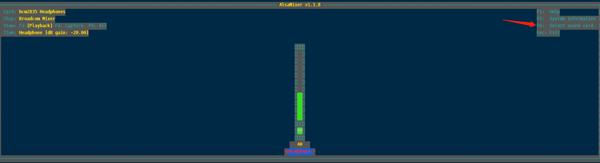
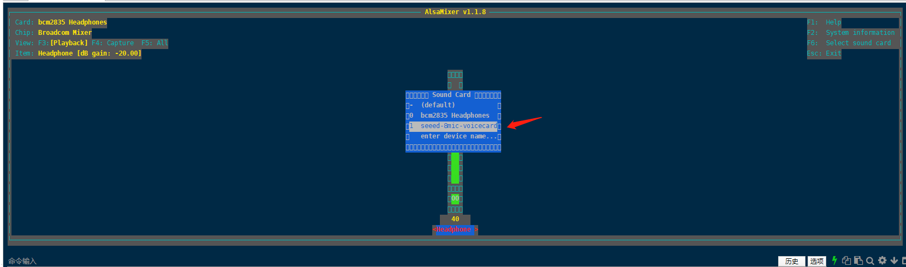
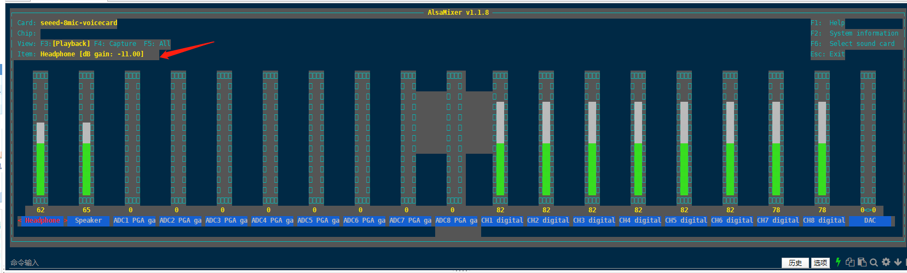
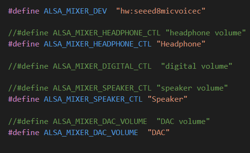

<a id="top"></a>


# **Levis**

Intelligent voice speaker Demo project on Raspberry Pi 4B+

## Introduction:

This demo *runs&&compile* on a *raspberry pi 4B+*. This demo can be used for phonological wake-up, and the wake-up word is "Xiao Le Xiao Le" in Chinese. After waking up, you can ask it to play music, set the alarm, adjust the volume, and chat with it.

*I hope that this open source project can evolve into a smart voice speaker system platform with a demo. Hope that interested people will work together to make it a top learning project.Welcome friends who are interested to join us.*

**Note:**

0. This program uses the python2.7 environment
1. The system image version we use is 2020-02-13-raspbian-buster-lite.
2. Raspberry login name: pi
3. Raspberry password: raspberry
4. pixel_ring #Has been integrated in the project, no need to download and install
5. Device: ReSpeaker 6-Mic Circular Array kit && Raspberry Pi 4 Model B
6. [Raspberry Pi 4B+ System Install && Device Info](raspbian_buster_lite_os/README.md#top) -**System installation and usage instructions**

## Install updates

### Change the source to Tsinghua Source

* sudo nano /etc/apt/sources.list.d/raspi.list
```

Use # to comment out the content of the original file and replace it with the following:
deb https://mirrors.tuna.tsinghua.edu.cn/raspberrypi/ stretch main ui
deb https://mirrors.tuna.tsinghua.edu.cn/raspberrypi/ buster main ui
deb-src https://mirrors.tuna.tsinghua.edu.cn/raspberrypi/ buster main ui
```

* sudo nano /etc/apt/sources.list
```

Use # to comment out the content of the original file and replace it with the following:
deb https://mirrors.tuna.tsinghua.edu.cn/raspbian/raspbian/ buster main non-free contrib
deb https://mirrors.ustc.edu.cn/raspbian/raspbian/ buster main contrib non-free rpi
deb-src https://mirrors.tuna.tsinghua.edu.cn/raspbian/raspbian/ buster main non-free contrib

Note:

If it is a version before 2019-06-20, you need to modify the buster to Stretch. You can check when the version was released by cat /etc/rpi-issue.
```

### Install update software

* sudo apt-get update
* sudo apt-get upgrade
* sudo apt-get install git
* sudo apt-get install cmake
* sudo apt-get install vim

* git clone https://github.com/respeaker/seeed-voicecard.git
* cd seeed-voicecard
* sudo ./install.sh   #Install sound card driver
* sudo reboot

### Check to see if the sound card is installed correctly

* arecord -L #View sound card information
```

#The following information is displayed normally

null
    Discard all samples (playback) or generate zero samples (capture)
default
playback
dmixed
ac108
multiapps
ac101
sysdefault:CARD=seeed8micvoicec
    seeed-8mic-voicecard,
    Default Audio Device
dmix:CARD=seeed8micvoicec,DEV=0
    seeed-8mic-voicecard,
    Direct sample mixing device
dsnoop:CARD=seeed8micvoicec,DEV=0
    seeed-8mic-voicecard,
    Direct sample snooping device
hw:CARD=seeed8micvoicec,DEV=0
    seeed-8mic-voicecard,
    Direct hardware device without any conversions
plughw:CARD=seeed8micvoicec,DEV=0
    seeed-8mic-voicecard,
    Hardware device with all software conversions

```

* aplay -L #Check the sound card
```

#The following information is displayed normally

null
    Discard all samples (playback) or generate zero samples (capture)
default
playback
dmixed
ac108
multiapps
ac101
sysdefault:CARD=ALSA
    bcm2835 ALSA, bcm2835 ALSA
    Default Audio Device
dmix:CARD=ALSA,DEV=0
    bcm2835 ALSA, bcm2835 ALSA
    Direct sample mixing device
dmix:CARD=ALSA,DEV=1
    bcm2835 ALSA, bcm2835 IEC958/HDMI
    Direct sample mixing device
dsnoop:CARD=ALSA,DEV=0
    bcm2835 ALSA, bcm2835 ALSA
    Direct sample snooping device
dsnoop:CARD=ALSA,DEV=1
    bcm2835 ALSA, bcm2835 IEC958/HDMI
    Direct sample snooping device
hw:CARD=ALSA,DEV=0
    bcm2835 ALSA, bcm2835 ALSA
    Direct hardware device without any conversions
hw:CARD=ALSA,DEV=1
    bcm2835 ALSA, bcm2835 IEC958/HDMI
    Direct hardware device without any conversions
plughw:CARD=ALSA,DEV=0
    bcm2835 ALSA, bcm2835 ALSA
    Hardware device with all software conversions
plughw:CARD=ALSA,DEV=1
    bcm2835 ALSA, bcm2835 IEC958/HDMI
    Hardware device with all software conversions
sysdefault:CARD=seeed8micvoicec
    seeed-8mic-voicecard,
    Default Audio Device
dmix:CARD=seeed8micvoicec,DEV=0
    seeed-8mic-voicecard,
    Direct sample mixing device
dsnoop:CARD=seeed8micvoicec,DEV=0
    seeed-8mic-voicecard,
    Direct sample snooping device
hw:CARD=seeed8micvoicec,DEV=0
    seeed-8mic-voicecard,
    Direct hardware device without any conversions
plughw:CARD=seeed8micvoicec,DEV=0
    seeed-8mic-voicecard,
    Hardware device with all software conversions

```

### Test whether the sound card can be used

```

#It will capture sound on AC108 and save as a.wav
arecord -Dac108 -f S32_LE -r 16000 -c 8 a.wav
#Take care of that the captured mic audio is on the first 6 channels
 
#It will play sound file a.wav on AC101
aplay -D ac101 a.wav
#Do not use -D plughw:1,0 directly except your wave file is single channel only.
 
#Doing capture && playback the same time
arecord -D hw:1,0 -f S32_LE -r 16000 -c 8 to_be_record.wav &
#mono_to_play.wav is a mono channel wave file to play
aplay -D plughw:1,0 -r 16000 mono_to_play.wav

```

### Install LED-related libraries
```

sudo apt-get -y install python-pip
sudo pip install pyusb
sudo pip install spidev
sudo pip install gpiozero

```

### Modify the source code

Communicating with TTS and ASR servers requires modifications to the source code.

#### 1.Developer account application
* visit website https://voice.lenovomm.com/voicePlatform/welcome/index.html
* Register an account on the official website, and obtain the Lenovo key AK and security key SK in the developer account page.


#### 2.Modify file (Levis/frame_work/frame_work_common_def.h)
```

// Modify the macro, According to your key
#define LENOVOKEY_FRAMEWORK "lenovoKey: XXXXXXXXX"  
#define SECRETKEY_FRAMEWORK "secretKey: XXXXXXXXX" 

// if your Lenovo key AK is 123456, Modify the macro LENOVOKEY_FRAMEWORK.
#define LENOVOKEY_FRAMEWORK "lenovoKey: 123456"
// if your security key SK is abcdef, Modify the macro SECRETKEY_FRAMEWORK.
#define SECRETKEY_FRAMEWORK "secretKey: abcdef"
```

Compile:
-----------------------------------
Compile the project on the raspberry pi 4B+.

```

git clone http://10.110.130.242:8081/liyanan/Levis.git
cd Levis 
./compile.sh  

```

### Compile error info :
```

/home/pi/Levis/frame_work/frame_work.cpp:26:10: fatal error: python2.7/Python.h: No such file or directory 

input the command：
sudo apt-get install python-dev
```

###  Compile error info:
```

/home/pi/Levis/frame_work/play_audio.h:28:10: fatal error: alsa/asoundlib.h: No such file or directory 

input the command：
sudo apt-get install libasound2-dev
```

### Compile error info:
```

/usr/bin/ld: cannot find -lcurl
/usr/bin/ld: cannot find -lcrypto
/usr/bin/ld: cannot find -lssl

reference the command：
cd /usr/lib/arm-linux-gnueabihf 
sudo ln -s libcrypto.so.1.1 libcrypto.so
sudo ln -s libssl.so.1.1 libssl.so
sudo ln -s libcurl.so.4 libcurl.so
```

A single execution:
-----------------------------------
Run the program after compilation.

```

cd runonboard    
sudo su    
bash framework_start.sh

```

###  If an error is reported during runtime. 'Failed to find mixer element'
Use alsamixer to view sound card seeed8micvoicec information  
1. Command line input: alsamixer 
2. Press F6

3. Select the sound card "seeed-8mic-voicecard". 

4. View the item name. (speaker && headphone && DAC)


5. According to information modify macro definition in Levis/frame_work/framework_volume_ctl.h


### If an error is reported during running. "snd_pcm_drain: Assertion 'pcm' failed."
```

Respeaker_Framework_Main: pcm.c:1282: snd_pcm_drain: Assertion 'pcm' failed.
framework_start.sh line 8: 1876 Aborted  (core dumped) ./Respeaker_Framework_Main

```
1. Check to see if there are other programs using the sound card.  
2. If another program uses a sound card, kill the process.

Start up and run program after power on
--------------------------------
If you want to self-starting the program after powering on the device.

```

0. sudo su 
1. sudo cp /etc/rc.local /etc/rc.local_bak
2. sudo nano /etc/rc.local
3. Add the following && Before exit 0.

yourpath='/home/pi/Levis/runonboard'
cd $yourpath
chmod 777 $yourpath/framework_start.sh
chmod 777 $yourpath/self_start.sh
sh $yourpath/self_start.sh

```

## Description of music playing module
At present, the demo can only play music locally.  
The way to access and play music on the Internet is temporarily unavailable due to the experimental environment.  
We hide the PARAMETERS and URL of the HTTP header.  

**Note:**

Currently only MP3 format is supported.You can add your own codec to support more formats.

MP3 files must be of high quality MP3 format.

* Levis/local_music Storing music files
The music file is named as follows.

```

artist_songname.mp3
songname.mp3
songname_artist.mp3
```

* The macro definition in the Levis/frame_work/frame_work_common_def.h  
```
#define PLAY_LOCAL_MUSIC (1)  //  1:local 0:online  Currently only local music can be played. Online access to music environment is not available because it is a test environment.
```
* The macro definition in the Levis/frame_work/play_audio.h
```
#define LOCAL_MUSIC_PATH "../local_music"  //  Can be modified to your own path
```

How to use the speaker
-----------------------------------

1. Wake up speaker
*  Say wake-up word "Xiao Le Xiao Le" in Chinese. 
2. Say command after wake up.
*  Set Clock.  You can say. "Yi Fen Zhong Hou Jiao Wo Chi Fan." in Chinese .
*  Chat with speaker. You can say. "How's the weather today" in chinese. Of course you can chat with it and say anything.
*  Play Music. You can say. "Play Little Apple" in Chinese. Of course you can make it play any song as long as there is this song in the library.
*  Stop playing song. You can say. "Stop play" in chinese.  Currently it can only stop playing, not pause playing.
*  Set the volume. You can say. "Tiao Gao Yin Liang " or "Tiao Di Yin Liang" in Chinese.

Docs:
-----------------------
* [Levis Reference](docs/Readme.md#top) - getting started
* [Install seeed-voicecard reference official document](https://wiki.seeedstudio.com/ReSpeaker_6-Mic_Circular_Array_kit_for_Raspberry_Pi/)

## GDB debug core file, add -g at compile time
1. ulimit -c unlimited
2. gdb [exec file] [core file]  
3. bt   #Then enter 'bt' to see the stack information.

Dependences:
-----------------------
ARMNN: https://www.arm.com/products/silicon-ip-cpu/ethos/arm-nn

NE10: https://github.com/projectNe10/Ne10

FFMPEG: http://ffmpeg.org/download.html

Tensorflow Lite: https://www.tensorflow.org/lite/guide/build_rpi

libmad: https://www.underbit.com/products/mad/

cJSON: https://github.com/DaveGamble/cJSON

ALSA: https://github.com/alsa-project

Protobuf: https://github.com/protocolbuffers/protobuf

curl: https://github.com/curl/curl

pixel_ring: https://github.com/respeaker/pixel_ring  #We made some changes to this open source code

The other libs are using RPI's local libs, and the audio preprocess libs is developed by Lenovo AI research Lab, we welcome you to use them directly.

Contact information:
----------------------
You could leave your questions in the github issue, or you could email to below directly:
* 张琛雨 zhangcy34@lenovo.com
* 李雅南 liyn22@lenovo.com

License:
-----------------------
BSD license
